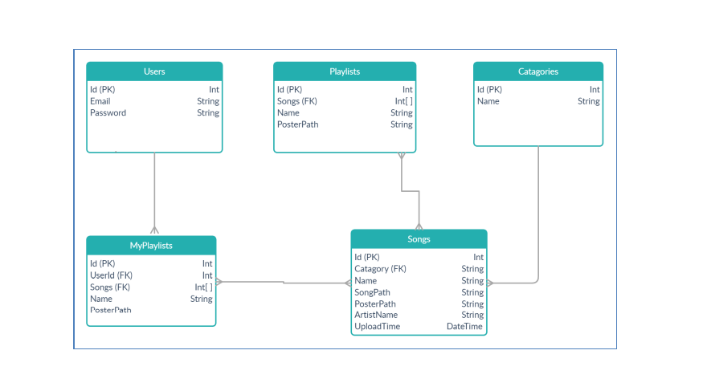
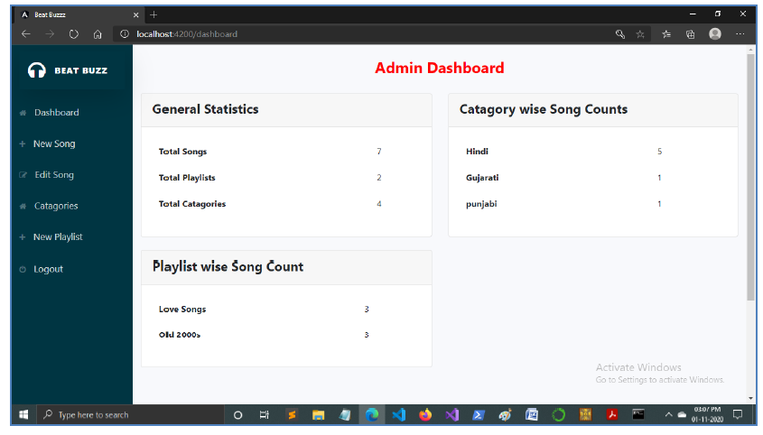
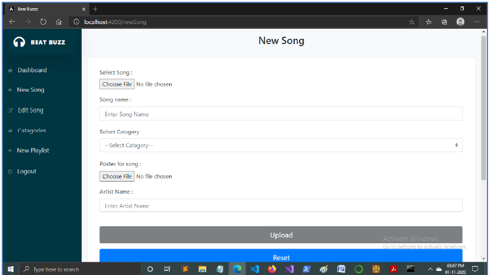
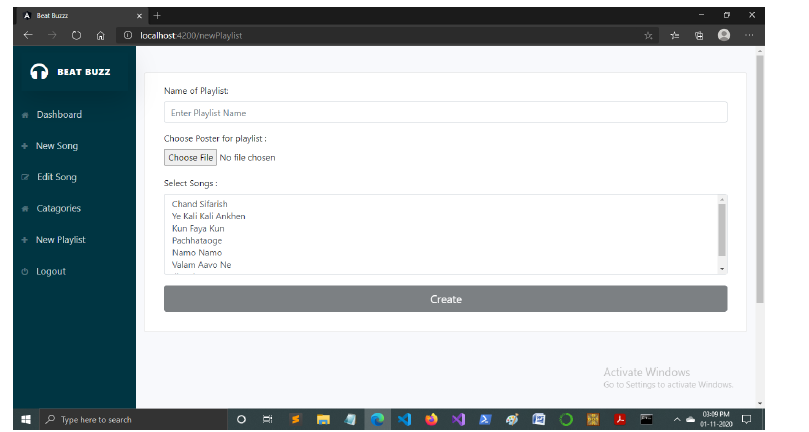
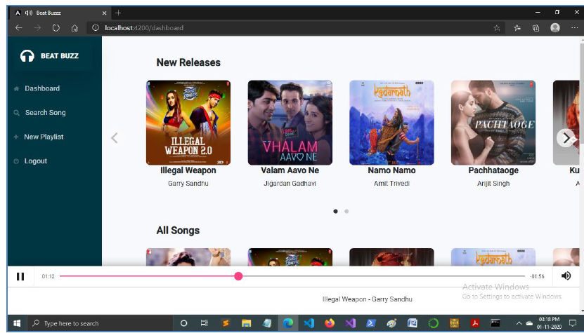
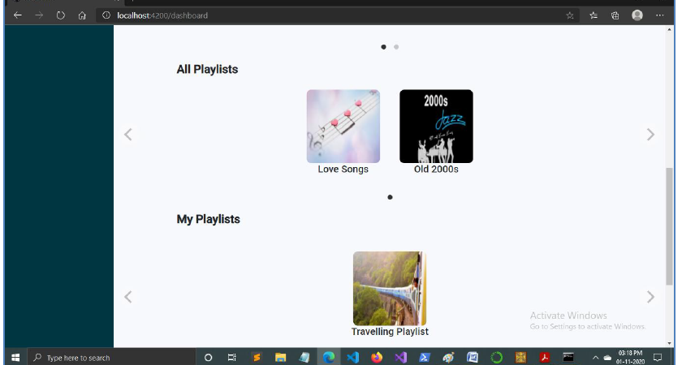
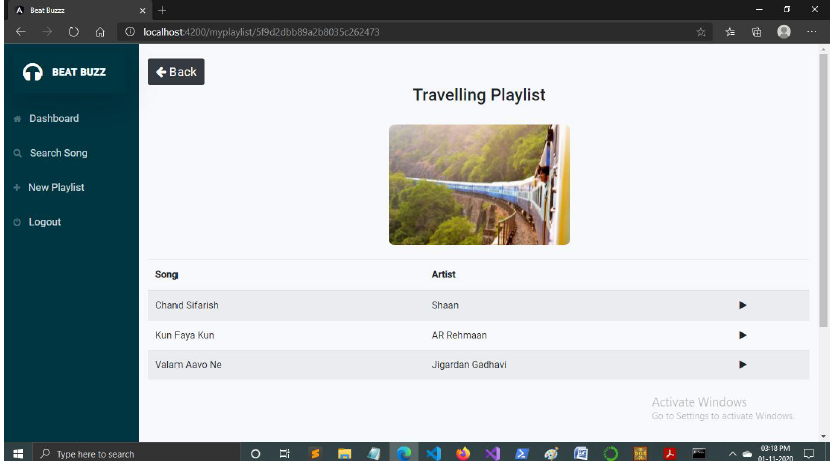

# Online Music Player

Academic project on Online Music Player implemented using MEAN stack.

## Getting Started

These instructions will get you a copy of the project up and running on your local machine for development and testing purposes. 

### Prerequisites

* nodejs
* npm
* mongodb


### How To run

* #### Install Node.js & mongoDb
* To run Backend API Of Admin :-
```
$ git clone https://github.com/ayanshaikh18/Online-Music-Player.git
$ cd Online-Music-Player
$ cd Online-Music-Player-Admin/node
$ npm start
```

* To run Angular Application of Admin :-

```
$ cd Online-Music-Player-Admin
$ ng serve -o
```

* To run Backend API Of User :-
```
$ cd Online-Music-Player
$ cd Online-Music-Player/node
$ npm start
```

* To run Angular Application of User :-

```
$ cd Online-Music-Player
$ ng serve -o
```


## Database ER Diagram



## Major Technologies Used in Project

* [Angular](http://angular.io/)
* [MongoDb](https://www.mongodb.com/) 
* [Node.js](https://nodejs.org/en/) 
* [Express.js](https://expressjs.com/)

## Authors

* [Mahammadayan Shaikh](https://github.com/ayanshaikh18/)


## Screenshots Of Running Application :-

<table>
  <tr>
    <td><td>
    <td><td>
  </tr>
  <tr>
    <td><td>
    <td><td>
  </tr>
  <tr>
    <td><td>
    <td><td>
  </tr>
  
</table>
